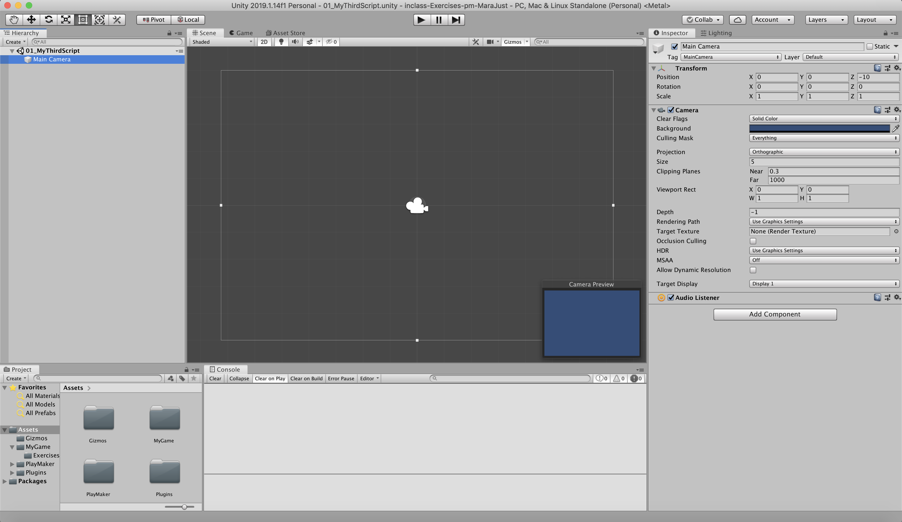

# inclass-Exercises-pm-MaraJust

### Project Description: 

 work with gitHub, README, C#, unity, Playmaker and git to improve my skills

### Development platform: 

MacOS Mojave (10.14.6), Unity 2019.1.14f1, Visual Studio Code 1.38.1

### Target platform: 

WebGL (RefRes: 1280x720 HD-720p)  

### Third Party Material:

Playmaker 1.9.0.p9

### Game control:

no control

### Screenshots:

### Limitations: 

TODO (I don't know what I have to write in here)
    
### Lessons Learned:

How to program with C# and Playmaker

Copyright by MaraJust